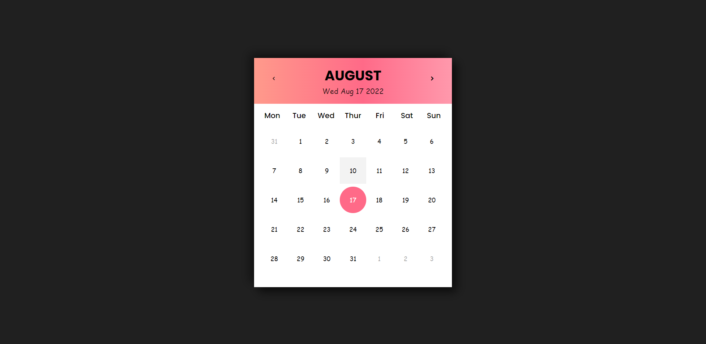

<h1 align = "center">Calender</h1>
This is a simple HTML, CSS, JS based calendar. It's sole purpose is to display the dates depeneding on the month and year of the session.

## Resources
Follwing resources have been used in maing this project:
- [Google Font](https://fonts.google.com/specimen/Poppins?query=po) for getting the poppins family out of the box
- [Box-Icons](https://boxicons.com/) to import some icons into the project that will be helpful later on
  

## Demo
If you want to checkout this project in running state then you can visit the link given below:
 
[Calendar Project](https://calendar-pied.vercel.app/)
 
If you like this project then you can star this repository

  

## GUI

  

## Technology Stack
Follwing technologies have been used at the core of this application to make it stand in the market place:
- HTML
- CSS
- JS
  

## Deployment Details
The website is deployed using the free hosting provided by **Vercel**

  

  
Later on the link was customized using the well known url shortner and customizer **Rebrandly**:  

  

  

## Developer
Muhammad Abdullah Butt  
abdullahbutt12292210@gmail.com  
> [Instagram](https://www.instagram.com/abdullah.butt.22/) 
> [FaceBook](https://www.facebook.com/profile.php?id=100076291614529) 
> [YouTube](https://www.youtube.com/channel/UCnuOFQyMywg-KuoN-lmav1Q) 
> [Portfolio](https://rebrand.ly/muhammadabdullahPortfolio) 
> [Website](#)
